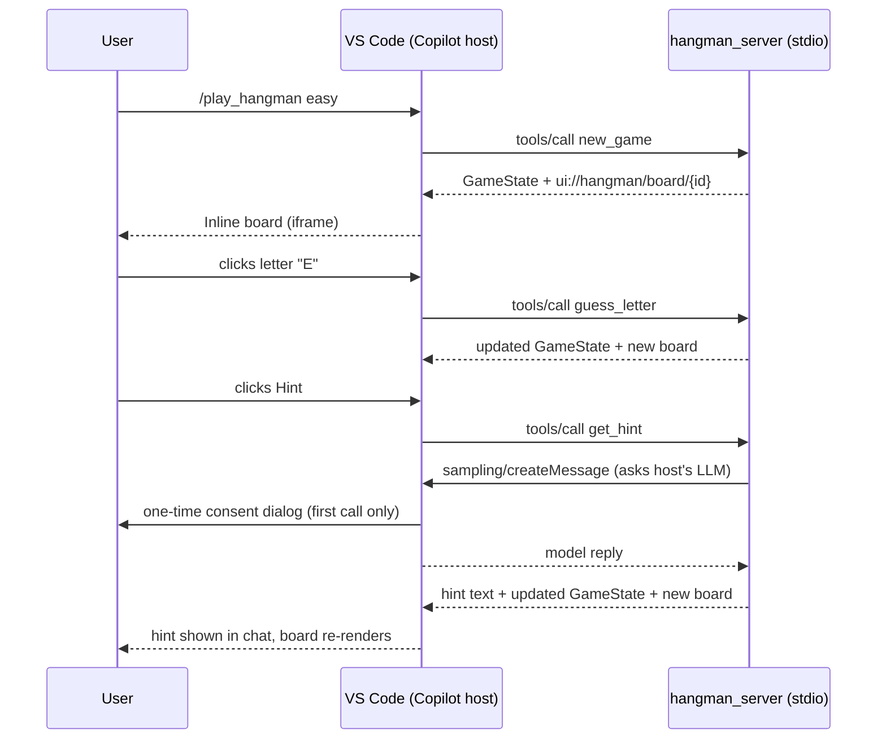

## Overview

This is a small Python [MCP](https://modelcontextprotocol.io/) server that exposes Hangman as a set of tools — and uses two of MCP's more interesting capabilities to make the experience feel native inside VS Code Copilot Chat:

* **MCP Apps** (spec `2026-01-26`) renders an interactive Hangman board inline in the chat panel. The board has a clickable keyboard, a score display, and a Hint button. Clicks `postMessage` back to the host, which dispatches them as tool calls.
* **MCP Sampling** powers `get_hint`. Instead of holding its own LLM key, the server asks the host (VS Code Copilot) to run a sampling round-trip on its behalf. Difficulty drives the hint style — beginner-friendly clue on easy, cryptic crossword-style on hard.

The point is to *see* the host ↔ server ↔ sampling loop end to end, with the LLM doing load-bearing work that the server alone cannot do.

## What runs where



## Quickstart

Prerequisites: Python 3.11+, [`uv`](https://docs.astral.sh/uv/), VS Code with GitHub Copilot Chat.

```pwsh
# from the repo root
uv sync
```

Then in VS Code:

1. Reload the window so the host picks up [`.vscode/mcp.json`](.vscode/mcp.json) — it registers the `hangman` stdio server.
2. Open Copilot Chat and invoke the `play_hangman` prompt (slash menu), or just type *"start a hangman game"*.
3. Click letters on the rendered board. Click **Hint** when you want LLM help.

On the first Hint click you'll see a one-time **sampling consent dialog** from VS Code asking whether to let the server use Copilot to generate text. Approve it once and subsequent hints are seamless.

## Manual driving with MCP Inspector

For a no-host development loop — useful when iterating on tool shapes or the rendered HTML:

```pwsh
npx @modelcontextprotocol/inspector uv run python -u -m hangman_server
```

In the Inspector UI:

* **Tools** tab — call `new_game`, then `guess_letter` / `guess_word` / `get_state` / `give_up` using the returned `game_id`. Each response includes `structuredContent` (the `GameState`) and `_meta.ui.resourceUri`.
* **Resources** tab — fetch `ui://hangman/board/{id}` to see the rendered HTML.
* `get_hint` won't work in Inspector because Inspector doesn't fulfill sampling requests — use VS Code for the full hint path.

## Scoring

| Event              | Delta                  |
|--------------------|------------------------|
| Correct letter     | `+10 × matches × mult` |
| Solve bonus (word) | `+50 × mult`           |
| Wrong letter       | `-1 × mult`            |
| Wrong word guess   | `-5 × mult`            |
| Hint               | `-5 × mult`            |

`mult` is `2` on hard, `1` on easy. Scores can go negative.

## Difficulty

* **easy** — short, common words (APPLE, RIVER, PIANO…); hints are direct ("A red fruit kids like in lunches").
* **hard** — long, uncommon words (CHIAROSCURO, PHLEGMATIC…); hints are cryptic and allusive, multiplier doubles every point delta.

## Repository layout

```text
src/hangman_server/
    __main__.py        # entrypoint -> mcp.run()
    server.py          # FastMCP tools + prompt + sampling-powered get_hint
    game.py            # pure rules: GameState, _Game, scoring
    ui.py              # render_board(state) -> sandboxed-iframe HTML
tests/
    test_game.py       # rules + scoring suite (pytest)
.vscode/
    mcp.json           # registers hangman as a stdio server
```

## Running the tests

```pwsh
uv sync --extra dev
uv run pytest -q
```

## Phase-2 pointer: SPA over Streamable HTTP

This v1 sample uses **stdio** transport because VS Code spawns the server. To put the same gameplay behind a single-page web app:

1. Change [`__main__.py`](src/hangman_server/__main__.py) to `mcp.run(transport="streamable-http")`.
2. Stand up a small frontend that drives the MCP protocol over HTTP and fulfills `sampling/createMessage` against an LLM of your choice (Azure AI Foundry, OpenAI, Ollama…).
3. Everything in `game.py`, `ui.py`, and the `@mcp.tool()` definitions stays the same.

The research notes under `.copilot-tracking/research/2026-05-20/` capture the design tradeoffs for that path.

## Troubleshooting

* **VS Code shows the server but tool calls hang** — confirm `.vscode/mcp.json` still passes `python -u` and sets `PYTHONUNBUFFERED=1`. Without them the Python child buffers stdout on Windows and the `initialize` handshake stalls.
* **Iframe doesn't re-render between turns** — some MCP Apps clients cache by resource URI. If you hit this, append a turn-counter query string to `resource_uri` in [`server.py`](src/hangman_server/server.py) (e.g. `ui://hangman/board/{id}?t={turn}`).
* **Hint button does nothing** — make sure you approved the sampling consent dialog. Check the server's stderr (VS Code's MCP output channel) for `Sampling failed: …`.
